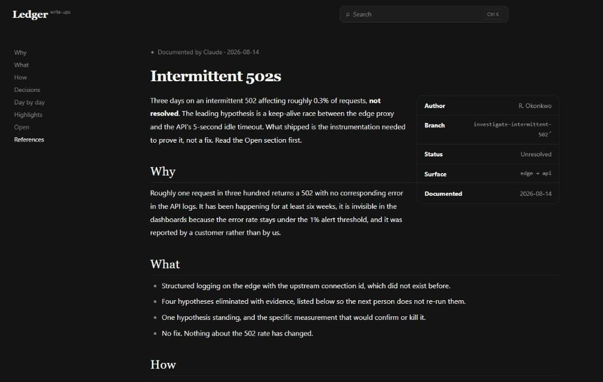
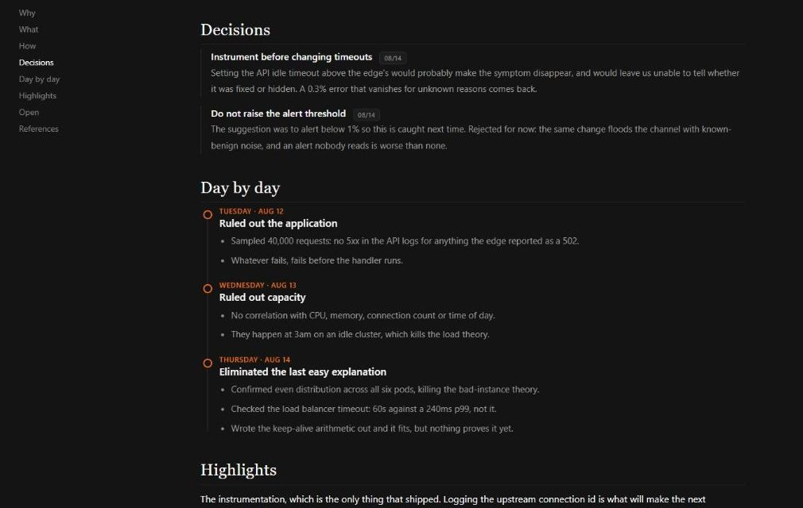
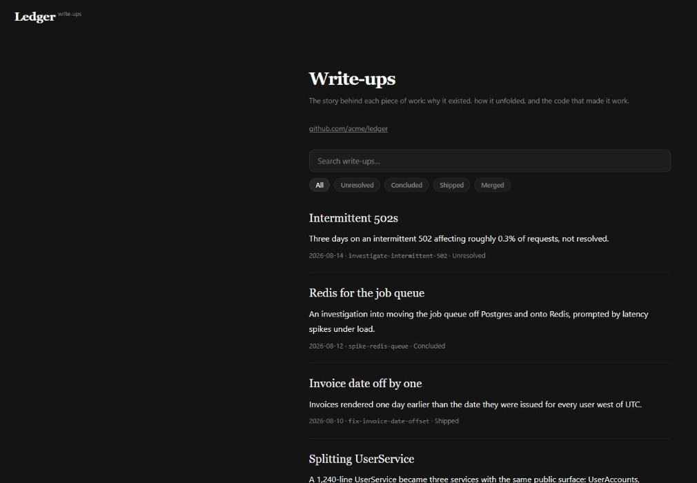

<h1 align="center">Write-up</h1>

<p align="center">
  <b>Git records what changed. Write-up records why.</b>
</p>

<p align="center">
  A Claude Code plugin that turns a finished piece of work into a self-contained HTML
  article, and those articles into a small local wiki.
</p>

<p align="center">
  
  
  
  
</p>

<p align="center">
  <a href="https://cwhitelam.github.io/write-up/"><b>Live demo</b></a> &nbsp;&middot;&nbsp;
  <a href="https://cwhitelam.github.io/write-up/wiki/write-up.html">A real article</a> &nbsp;&middot;&nbsp;
  <a href="#install">Install</a> &nbsp;&middot;&nbsp;
  <a href="#using-it-with-another-agent">Other agents</a>
</p>

<br>

<p align="center">
  
</p>

<br>

## The problem

A commit preserves a diff and a one-line message. A pull request adds a title and whatever
the author had the patience to type into the description box.

Neither preserves the three approaches that were tried and abandoned, the constraint that
made the obvious design impossible, or the one function that turned out to be the whole
trick. That context lives in a chat transcript nobody will ever reopen.

The gap is worst exactly where it hurts most: six months later, when someone (often the
original author) asks why a thing was built this way and the honest answer is that nobody
remembers.

**The reasoning is complete for about an hour after the work is done.** This catches it while
it is still there, at close to zero cost, because the model already holds the story.

## Install

Two commands inside Claude Code:

```
/plugin marketplace add cwhitelam/write-up
/plugin install write-up@cwhitelam
```

That installs the skill and wires the Stop hook. Nothing to clone, nothing to paste into
`settings.json`. If the install summary says `Run /reload-plugins to activate`, run it.

Then, in any repo you want documented, ask Claude:

```
/write-up setup
```

It reads your git remote, works out whether you are on GitHub, GitLab, Bitbucket, or Azure
DevOps, and writes a `.write-up.json` with the right link patterns. An unrecognised host is
fine: articles just do not link to code.

<details>
<summary><b>Installing without the plugin system</b></summary>

<br>

For an older Claude Code, another agent, or a copy you want to edit in place:

```bash
git clone https://github.com/cwhitelam/write-up.git
cd write-up
./install.sh                    # copies to ~/.claude/skills/write-up
```

That prints the Stop hook snippet to paste into `~/.claude/settings.json`, since a sed-merge
into a config you care about is a bad trade for the twenty seconds it saves. `--project`
installs into one repo instead of your home directory, `--uninstall` removes it.

</details>

## What an article is

Six fixed sections, always in the same order, so a reader who has seen one article can skim
any other:

| Section | What goes in it |
|---|---|
| **Why** | The problem that started it. What hurt, in plain sentences. |
| **What** | What exists now that did not before. |
| **How** | The path in order, with real trade-offs inline: "chose X over Y because Z". Roads not taken survive here. |
| **Decisions** | The load-bearing choices as a dated Architecture Decision Record log. |
| **Day by day** | A dated journal, one entry per working day. |
| **Highlights** | The two or three snippets that actually made it work, verbatim, each with one line on why it is the trick. |

Plus an optional **Open** section for caveats and live questions, a **See also** for related
articles, and a **References** list linking each snippet back to its source file.

<p align="center">
  
</p>

Every page is one HTML file. No build step, no framework, no network, no dependencies. It
opens from disk in three years the same way it opens today.

## The wiki

Articles accumulate into a generated front page with full-text search, status filters, hover
previews on every cross-article link, automatic "Referenced by" backlinks, glossary hovercards
for the terms only your team knows, and a light/dark toggle.

<p align="center">
  
</p>

```
docs/write-ups/
├── index.html          generated front page (search, filters, newest first)
├── manifest.js         generated search index and backlink graph
├── write-up-ui.js      shared runtime
├── glossary.js         your curated term definitions
├── assets/<slug>/      screenshots, if any
└── <slug>.html         one article per piece of work
```

## It does not have to be code

The unit is a piece of work, whatever that means for you: a branch, a feature, a debugging
session that finally landed, a refactor, a spike that answered a question. Research that
reached a conclusion, a data investigation, a decision argued out over one long session: all
of it fits the same six sections. No ticket system required, no issue number, no branch.

**In a repository**, `/write-up setup` puts articles in `docs/write-ups/` and links them back
to code through your forge.

**In your home directory**, for work with no repo at all:

```bash
writeup.py init --home        # or just run init outside any repo
```

Articles go to `~/.claude/write-ups/` under the wordmark **Notebook**. Nothing links to code,
because there is no code. Which one you get is automatic: an initialised repo always wins,
then a home config, then any repo, then home.

## The Stop hook

Deliberately quiet. It fires only when a branch actually looks finished: clean tree, ahead of
the default branch, and pushed. Then it asks for a write-up exactly once. If real work lands
after the article was written it asks once more for a refresh. That is the entire trigger
surface, and it never touches the network.

It stays silent on `main`, `master` and `develop`, and silent in any directory that is not a
repository, because branch state is the only honest "this is finished" signal there is. A hook
that guessed would interrupt constantly and get switched off. Use `/write-up` there instead.

Silence a branch with `docs/write-ups/.skip-<slug>`, day entries with `.skip-day-<slug>`, or
everything with `hook.enabled: false`.

## Python is optional

Everything above runs on **git and a POSIX shell**. The hook is a shell script, and the skill
maintains the wiki with Claude's own file tools.

There is also `scripts/writeup.py` (Python 3.8+, standard library only) for the mechanical
jobs: rebuilding the whole index from disk, mining old session transcripts, proposing glossary
terms, capturing desktop screenshots, and checking merged pull requests. The skill checks for
it and falls back cleanly when it is missing.

<details>
<summary><b>Why the split, and what each command does</b></summary>

<br>

Claude Code runs hook commands through `sh -c` on macOS and Linux and Git Bash on Windows, so
a shell script needs nothing installed anywhere. Python is not in that position: macOS has
shipped no bundled Python 3 since 12.3, where `python3` is a stub that triggers an Xcode
Command Line Tools prompt, and Windows ships none at all.

| Command | What it does |
|---|---|
| `init` | Write `.write-up.json`, create the wiki folder, install the runtime JS. `--home` for the repo-less wiki. |
| `build` | Rebuild `index.html` + `manifest.js` from every article on disk. Repair tool; the skill keeps them in step as it writes. |
| `digest` | Replay past Claude sessions. `--list` indexes every session; `--session`, `--branch`, `--since`, `--grep`, `--all` scope it. |
| `hooks/write-up-digest.sh` | The same replay in POSIX sh, for scheduled capture with no Python at all. `--since`, `--session`, `--all`, `--projects`. Skips `/compact` and compaction summaries, which the Python one keeps. |
| `suggest` | Propose glossary candidates from an article's prose. |
| `shot` | Capture a screenshot into the article's assets folder. |
| `sweep` | List Mid-flight articles whose pull request has merged. The only command that makes a network call. |
| `doctor` | Check the install and report what is missing. |

</details>

## Using it with another agent

Three things assume Claude Code. Everything else does not.

| Claude Code piece | Substitute |
|---|---|
| `plugin/SKILL.md` | Only the frontmatter is Claude-specific. Paste the body into `AGENTS.md`, a Cursor rule, or a system prompt. |
| `plugin/hooks/write-up-hook.sh` | Plain git and plain `sh`, always exits 0. Drive it from a git alias or a CI step and treat non-empty stdout as a request; the `reason` field is the prompt to hand your model. |
| `writeup.py digest` | Point it at your agent's transcript directory, or skip the command. |

Portable with no changes: both HTML templates, the wiki runtime, and every other `writeup.py`
command. The six-section structure is prose instructions, so it transplants as-is.

This is an article format plus a small static wiki, with a Claude Code integration attached.
If you use something else, you keep the format and rewire one hook.

## Configuration

`.write-up.json` at the repo root:

```json
{
  "project": "Acme Web",
  "outputDir": "docs/write-ups",
  "forge": {
    "type": "github",
    "repoUrl":   "https://github.com/acme/web",
    "branchUrl": "https://github.com/acme/web/tree/{branch}",
    "fileUrl":   "https://github.com/acme/web/blob/{branch}/{path}",
    "ticketUrl": "https://github.com/acme/web/issues/{id}",
    "prUrl":     "https://github.com/acme/web/pull/{id}",
    "defaultBranch": "main"
  },
  "hook": {
    "enabled": true,
    "wrapUp": true,
    "dayEntries": true,
    "skipBranches": ["main", "master", "develop"]
  }
}
```

The URL patterns are just strings with `{branch}`, `{path}` and `{id}` substituted, so a
self-hosted forge is a two-minute fix.

By default the wiki is committed with your repo, so it is team content. `init --private` puts
it in `.git/info/exclude` instead: never staged, never merged, a personal record on your
machine.

## Privacy

`digest` reads Claude Code's own transcripts under `~/.claude/projects`. Read-only, never
written to, and nothing leaves your machine. Every other command touches only your repo.

The single exception is `writeup.py sweep`, which queries your forge for merged pull requests.
You have to run it yourself, and it is the only network call in the tool.

## Platform support

| | Windows | macOS | Linux |
|---|---|---|---|
| Skill, wiki, Stop hook | yes | yes | yes |
| `writeup.py` (optional) | yes | yes | yes |
| `shot --screen` | yes | yes (needs Pillow or `screencapture`) | yes (needs Pillow or ImageMagick) |
| `shot --window` | yes | no | no |

On Windows the hook needs Git Bash, which Git for Windows installs and Claude Code already
uses for its shell. Window-targeted capture uses the Win32 API and has no portable
equivalent; the macOS and Linux screen fallbacks are written against the standard tools but
have not been exercised on those platforms.

## Uninstall

```
/plugin uninstall write-up@cwhitelam
```

Your wiki, your `.write-up.json` and your glossary are left alone.

## License

MIT. See [LICENSE](LICENSE).
